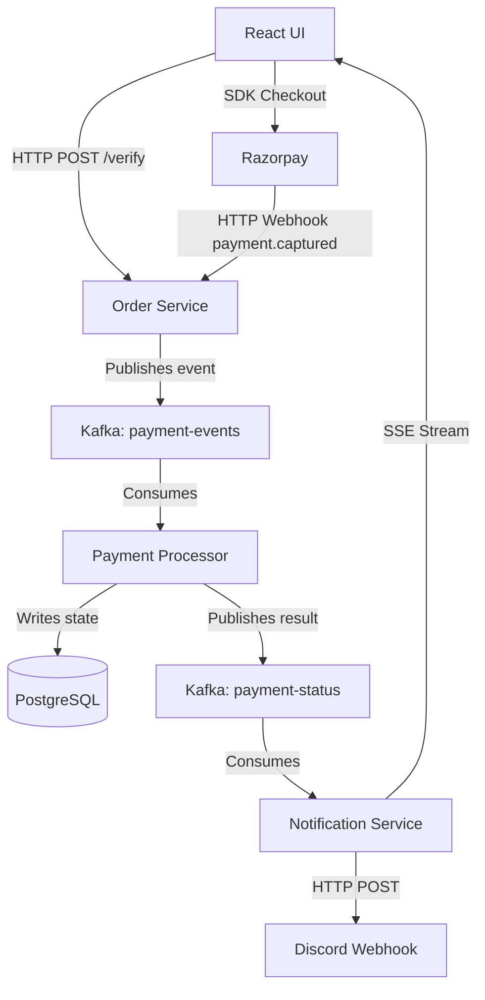

# PayFlow: Event-Driven Payment Processing Architecture

PayFlow is a distributed, microservices-based payment processing system built to handle transactions asynchronously and fault-tolerantly. 

Unlike traditional monolithic payment integrations that rely entirely on the client's browser connection, PayFlow implements a decoupled event-driven architecture using Apache Kafka. It ensures 100% data consistency between third-party payment gateways (Razorpay) and the internal PostgreSQL database by utilizing a dual-path verification system (Client-Side + Webhook Fallback).

# PayFlow: Event-Driven Payment Processing Architecture

PayFlow is a distributed, microservices-based payment processing system built to handle transactions asynchronously and fault-tolerantly. 

Unlike traditional monolithic payment integrations that rely entirely on the client's browser connection, PayFlow implements a decoupled event-driven architecture using Apache Kafka. It ensures 100% data consistency between third-party payment gateways (Razorpay) and the internal PostgreSQL database by utilizing a dual-path verification system (Client-Side + Webhook Fallback).

# PayFlow: Event-Driven Payment Processing Architecture

PayFlow is a distributed, microservices-based payment processing system built to handle transactions asynchronously and fault-tolerantly. 

Unlike traditional monolithic payment integrations that rely entirely on the client's browser connection, PayFlow implements a decoupled event-driven architecture using Apache Kafka. It ensures 100% data consistency between third-party payment gateways (Razorpay) and the internal PostgreSQL database by utilizing a dual-path verification system (Client-Side + Webhook Fallback).

## 🏗 System Architecture Diagram



## 🏗 System Architecture

The backend is strictly divided into purpose-built microservices, preventing the API gateway from being blocked by heavy database writes or third-party API latency.

1. **Order Service (API Gateway & Webhook Listener):** 
- Acts as the sole entry point for public HTTP traffic. It performs zero database writes to ensure high throughput.
   - Frontend Verification: Cryptographically verifies the Razorpay signature sent by the React client.

   - Webhook Listener: Hosts a secure, public-facing endpoint to catch asynchronous server-to-server events (payment.captured) directly from Razorpay.

   - Event Producer: Normalizes verified payloads and drops a uniform JSON event onto the Kafka payment-events topic.
2. **Payment Processor (Worker):** 
  - A locked-down background service isolated from the public internet.

    - Consumer: Blindly consumes from the payment-events topic.

    - Idempotency Guard: Checks PostgreSQL state before applying updates. If the React frontend and the Razorpay webhook fire simultaneously, the transaction is strictly processed once.

    - State Management: Executes core business logic and transitions database records from `PENDING` to `SUCCESS`.
3. **Notification Service (Broadcaster):**
   - Consumes from Kafka using an independent consumer group.
   - Pushes real-time status updates directly to the React frontend using Server-Sent Events (SSE).
   - Constructs and fires JSON payloads to a Discord Webhook for real-time administrative alerts via Rich Embeds.

## 🚀 Tech Stack

- **Backend:** Java, Spring Boot, Spring Data JPA
- **Message Broker:** Apache Kafka (Aiven / mTLS secured)
- **Database:** PostgreSQL / Hibernate
- **Frontend:** React.js, Tailwind CSS
- **Integrations:** Razorpay Payment API, Discord Webhooks API

## 🔑 Key Engineering Decisions

* **Dual-Path Failsafe:** If the client's browser drops connection immediately after payment, the React app fails to send the success payload. The system relies on Razorpay's webhook as a secondary source of truth, guaranteeing the database always updates regardless of frontend state.
* **Idempotency:** The worker service checks the database state before executing updates, ensuring that if both the frontend and the webhook fire simultaneously, the order is only processed once.
* **Decoupled Notifications:** By utilizing Kafka consumer groups, the notification service reacts to payment events without blocking the core payment processor's database transactions.

## ⚙️ Local Development Setup

### Prerequisites
- Java 23
- Node.js & npm
- PostgreSQL running on default port `5432`
- An active Kafka Cluster (Local or Cloud like Aiven)
- Ngrok (Required for local webhook testing)

### 1. Environment Variables
You must inject the following variables into your runtime environment or application profiles:
```env
# Razorpay Credentials
RAZORPAY_KEY_ID=your_key_id
RAZORPAY_KEY_SECRET=your_key_secret
RAZORPAY_WEBHOOK_SECRET=your_webhook_secret

# Kafka Configuration
KAFKA_BOOTSTRAP_SERVERS=your_kafka_url:port
KAFKA_SSL_TRUSTSTORE_LOCATION=path/to/ca.pem
KAFKA_SSL_KEYSTORE_LOCATION=path/to/client.pem

# Notifications
DISCORD_WEBHOOK_URL=[https://discord.com/api/webhooks/](https://discord.com/api/webhooks/)...
